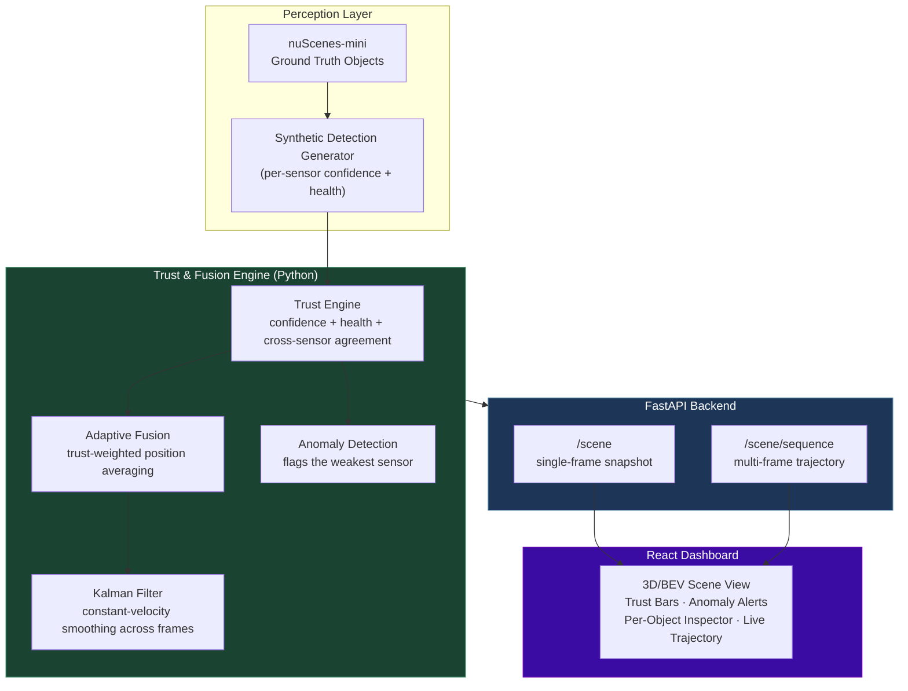
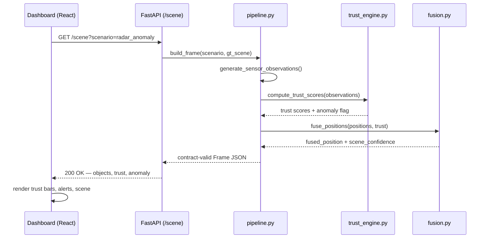

# TRUST3D

**Trust-Aware 3D Situational Awareness**

TRUST3D fuses camera, LiDAR, and radar detections into a single 3D scene — but instead of blindly trusting every sensor equally, it scores each sensor's reliability _per object, per frame_ and adaptively weights the fusion accordingly. When a sensor degrades (blur, occlusion, radar noise), TRUST3D notices, down-weights it, flags the anomaly, and keeps the scene stable using the sensors that still agree.

Built for **Infinity Hacks 2026 — Defence Track** by **Team NullS3ntin3l5**.

> "Don't just see the battlefield. Know how much you can trust what you see."

---

## Table of Contents

- [Problem](#problem)
- [Architecture](#architecture)
- [How Trust Scoring Works](#how-trust-scoring-works)
- [Folder Structure](#folder-structure)
- [Tech Stack](#tech-stack)
- [Getting Started](#getting-started)
- [API Reference](#api-reference)
- [Scope Decisions](#scope-decisions--what-is-real-vs-simulated)
- [Team](#team)
- [Roadmap](#roadmap)

---

## Problem

Autonomous and defence perception systems fuse multiple sensors (camera, LiDAR, radar) to build a picture of the environment. Most fusion pipelines assume every sensor is equally reliable at all times — but in the real world, sensors degrade: fog blinds cameras, jamming disrupts radar, dust occludes LiDAR. A system that fuses degraded data with full confidence produces a _confidently wrong_ picture, which is worse than an honestly uncertain one.

TRUST3D adds a trust layer on top of sensor fusion: every object's position is a trust-weighted combination of what each sensor reports, and every degradation is visible, not silently absorbed.

---

## Architecture



### Request flow (single scenario query)



---

## How Trust Scoring Works

For each object, each sensor gets a trust score:

```
trust(sensor) = 0.45 × confidence + 0.25 × health + 0.30 × cross_sensor_agreement
```

- **confidence** — the sensor's own detection confidence for this object
- **health** — simulated sensor health (1.0 = nominal, lower under degradation)
- **cross_sensor_agreement** — how closely this sensor's position estimate matches the _other_ sensors observing the same object (a sensor disagreeing with everyone else gets penalized even if its own confidence looks fine)

If one sensor's trust score falls significantly below the others (>0.25 gap), an **anomaly** is flagged naming that sensor. The final position is a **trust-weighted average** across all sensors — a low-trust sensor still contributes, just less, rather than being dropped outright. A **Kalman filter** (constant-velocity model) then smooths each object's position across frames, damping the frame-to-frame jitter that raw fusion alone leaves in.

---

## Folder Structure

```
Trust3D-null-S3ntin3l5/
├── README.md
├── requirements.txt
├── .gitignore
│
├── src/                          # Core trust & fusion pipeline (pure Python, framework-agnostic)
│   ├── schema.py                 # Shared JSON contract — the interface between pipeline and backend
│   ├── synthetic_detections.py   # GT-based per-sensor detection generator + corruption scenarios
│   ├── trust_engine.py           # Trust scoring + anomaly detection
│   ├── fusion.py                 # Trust-weighted adaptive position fusion
│   ├── kalman_filter.py          # Constant-velocity Kalman filter for trajectory smoothing
│   ├── pipeline.py               # Single-frame orchestration — build_frame()
│   ├── sequence.py               # Multi-frame trajectory orchestration — build_sequence()
│   ├── nuscenes_loader.py        # Real nuScenes-mini integration (ego-frame alignment)
│   ├── real_demo_objects.py      # Frozen real nuScenes objects used for the live demo
│   ├── generate_fixtures.py      # Mock-data fixture generator
│   └── generate_fixtures_real.py # Real-data fixture generator
│
├── tests/
│   └── test_pipeline.py          # Contract validation + behavioral tests (trust deltas, anomaly correctness)
│
├── demo_fixtures/                # Frozen JSON snapshots per scenario (demo safety net)
│   ├── normal.json
│   ├── camera_degraded.json
│   └── radar_anomaly.json
│
├── backend/                      # FastAPI service
│   ├── main.py                   # /scene and /scene/sequence endpoints
│   └── requirements.txt
│
└── frontend/                     # React + Vite dashboard
    ├── src/
    │   ├── App.jsx                # Main dashboard — scene view, trust bars, alerts, object inspector
    │   ├── App.css
    │   ├── api.js                 # getScene() / getSceneSequence()
    │   └── useSceneSequence.js    # Trajectory animation hook
    ├── package.json
    └── vite.config.js
```

---

## Tech Stack

| Layer                | Technology                                                |
| -------------------- | --------------------------------------------------------- |
| Perception data      | nuScenes-mini (real annotated driving scenes)             |
| Trust & fusion logic | Python (stdlib + NumPy)                                   |
| Coordinate alignment | nuscenes-devkit, pyquaternion                             |
| Backend API          | FastAPI                                                   |
| Frontend             | React + Vite                                              |
| Testing              | Custom stdlib test harness (contract + behavioral checks) |

---

## Getting Started

### Backend

```bash
cd backend
pip install -r requirements.txt
uvicorn main:app --reload
```

Runs at `http://127.0.0.1:8000`. Try `http://127.0.0.1:8000/scene?scenario=normal` in a browser.

### Frontend

```bash
cd frontend
npm install
npm run dev
```

### Running tests

```bash
python tests/test_pipeline.py
```

### (Optional) Real nuScenes-mini setup

```bash
pip install nuscenes-devkit pyquaternion numpy
```

Download nuScenes-mini from [nuscenes.org/download](https://www.nuscenes.org/download), extract so you have `<dataroot>/v1.0-mini/`, `<dataroot>/samples/`, `<dataroot>/sweeps/`, `<dataroot>/maps/`. See `src/nuscenes_loader.py` for usage — the live demo already runs on frozen real data via `src/real_demo_objects.py`, so this step is only needed to regenerate that data or pull a different sample.

---

## API Reference

| Endpoint          | Method | Params                                                        | Returns                                                                                    |
| ----------------- | ------ | ------------------------------------------------------------- | ------------------------------------------------------------------------------------------ |
| `/scene`          | GET    | `scenario` (`normal` \| `camera_degraded` \| `radar_anomaly`) | Single frame — objects, trust scores, fused positions, anomalies                           |
| `/scene/sequence` | GET    | `scenario`, `n_frames` (default 12)                           | Array of frames over time, each object includes `smoothed_position` from the Kalman filter |
| `/health`         | GET    | —                                                             | Service status                                                                             |

---

## Scope Decisions — What Is Real vs. Simulated

Built to a **24-hour** timeline. Some deliberate, disclosed scope cuts:

- **Detections are ground-truth-based, not inference-based.** Camera/LiDAR/radar "detections" come from nuScenes' real annotated ground truth, with synthetic per-sensor confidence layered on top — not from running YOLO or a LiDAR detector live. This let the 24 hours go toward the trust engine and adaptive fusion (the actual contribution) rather than perception model training.
- **Degradation is simulated, not physical.** `camera_degraded` and `radar_anomaly` scenarios lower synthetic confidence/health values rather than physically corrupting sensor input — the trust engine's response to degraded confidence is real and measured, the degradation trigger itself is a parameter.
- **Demo shows 4 of 69 real annotated objects** in the sampled scene, filtered for readability (2 pedestrians, 2 vehicles, closest to ego). Same trust/fusion logic runs identically at full scale.
- **Trust weights are hand-tuned, not learned.** A weighted-sum trust function, not a trained model — appropriate for a 24h MVP, called out explicitly as a roadmap item.

---

## Team

**NullS3ntin3l5** — Infinity Hacks 2026, Defence Track

- Manikanta Bojja
- V Praveen
- G Aprameya Goud

---

## Roadmap

- [ ] Learned trust model (replace hand-tuned weights with a trained classifier/regressor)
- [ ] Real-time perception inference (YOLO for camera, point-cloud processing for LiDAR) instead of GT-based synthetic detections
- [ ] Temporal reasoning across full object tracks, not just position smoothing
- [ ] GNSS integrity and thermal sensor integration
- [ ] Full-scene rendering (all annotated objects, not the readability-filtered subset)
